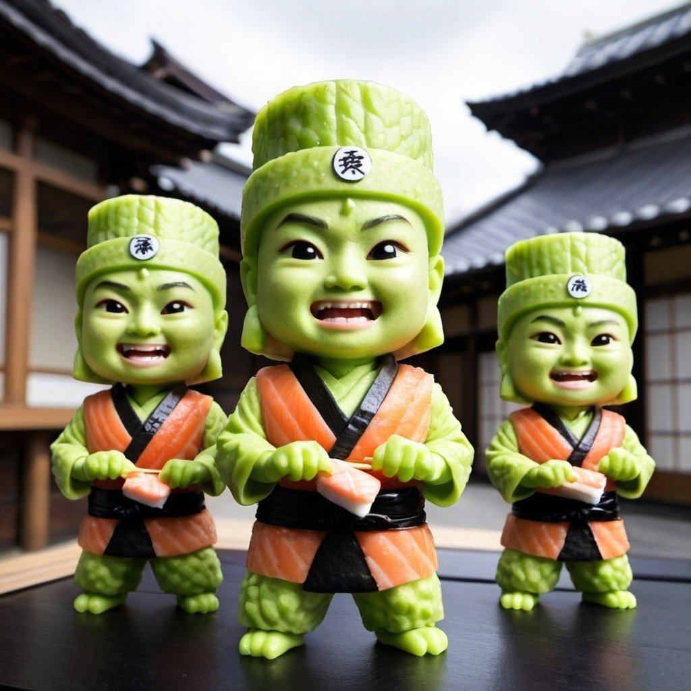
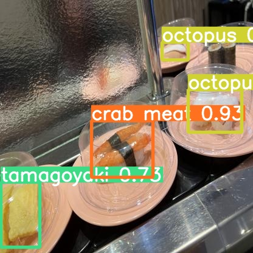

# Wasabi_Warriors
<!-- PROJECT LOGO -->
<br />
<p align="center">
  <a href="https://github.com/hyesungKomet/Wasabi_Warriors">
    
  </a>

  <h3 align="center">Wasabi Warriors</h3>


<!-- TABLE OF CONTENTS -->
<details open="open">
  <summary>Table of Contents</summary>
  <ol>
    <li>
      <a href="#about-the-project">About The Project</a>
      <ul>
        <li><a href="#built-with">Built With</a></li>
      </ul>
    </li>
    <li>
      <a href="#getting-started">Getting Started</a>
      <ul>
        <li><a href="#dependencies">Dependencies</a></li>
        <li><a href="#installation">Installation</a></li>
      </ul>
    </li>
    <li><a href="#usage">Usage</a></li>
    <li><a href="#roadmap">Roadmap</a></li>
    <li><a href="#contributing">Contributing</a></li>
    <li><a href="#license">License</a></li>
    <li><a href="#authors">Authors</a></li>
    <li><a href="#acknowledgements">Acknowledgements</a></li>
  </ol>
</details>


<!-- ABOUT THE PROJECT -->
## About The Project

스시 이미지에 대해 Multi-Class Classification 및 Object Detection을 수행하는 프로젝트입니다.

<div style="text-align: center;">
  <a href="https://github.com/hyesungKomet/Wasabi_Warriors">
    
  </a>
</div>

### Dataset
- Object Detection
  Roboflow Sushi Image Dataset
  - [sushi_dataset](https://universe.roboflow.com/sushi/sushi-4/dataset/1)
  - 10 Classes, 989장
- Multi-Class Classification
  - Detection dataset의 바운딩박스 정보를 통해 Crop한 이미지(4870장) + 웹스크래핑으로 확보한 이미지(1421장)
  - 12 Classes, 6291장
  - Train: 5370 Valid: 578 Test: 343


<!-- GETTING STARTED -->
## Getting Started


### Dependencies

* Install all requirements
  ```sh
  pip install -r requirements.txt
  ```
* Install Specific requirements
  ```sh
  gradio
  streamlit
  ultralytics
  tqdm
  torch
  torchvision
  torchaudio
  ```

### Installation

1. Clone the repo
   ```sh
   git clone https://github.com/hyesungKomet/Wasabi_Warriors.git
   ```
2. Setup (and activate) your environment
    ```sh
    pip install -r requirements.txt
    ```

<!-- USAGE EXAMPLES -->
## Inference
### Classification Inference
1. 학습된 모델을 다운받습니다.(현재는 sushiupdate_classifier_resnet50_10.pth)
    [resnet_download](https://drive.google.com/file/d/1ACCEvF8FQ2yXbFSs1ZnotwWaVb0UMdtN/view?usp=sharing)
2. Classification 모델은 Wasabi_Warriors/models 경로로 옮겨줍니다.
3. app_classification.py의 model_path 경로를 모델의 경로로 수정해줍니다.
4. inference 파일 실행
    ```sh
    python app_classification.py
    ```
5. gradio 내에서 Image Upload, Webcam 중 선택하여 추론을 진행합니다. Image Upload의 경우 데이터셋의 test의 이미지를 추론하면 더 잘 이루어집니다.

### Object Detection Inference
1. 학습된 모델을 다운받습니다.
    [yolov5_download](https://drive.google.com/file/d/1PdG0mSfce9K_AgftCm2Llb4xvRhVMMlN/view?usp=sharing)
2. Object Detection 모델은 Wasabi_Warriors/models\yolov5 경로로 옮겨줍니다.
3. app_yolo.py의 model path 경로를 모델의 경로로 수정해줍니다.
4. inference 파일 실행
    ```sh
    python app_yolo.py
    ```
5. gradio 내에서 Image Upload, Webcam 중 선택하여 추론을 진행합니다. Image Upload의 경우 데이터셋의 test의 이미지를 추론하면 더 잘 이루어집니다.

### Real-time Detection Inference
1. 학습된 모델을 다운받습니다.
    [yolov5_download](https://drive.google.com/file/d/1PdG0mSfce9K_AgftCm2Llb4xvRhVMMlN/view?usp=sharing)
2. Object Detection 모델은 Wasabi_Warriors/models\yolov5 경로로 옮겨줍니다.
3. app_yolo_realtime.py의 model path 경로를 모델의 경로로 수정해줍니다.
4. inference 파일 실행
    ```sh
    streamlit run app_yolo_realtime.py
    ```
5. streamlit 내에서 Webcam으로 실시간 탐지를 진행합니다.

## Train
### Classification Model
1. Dataset을 다운받습니다.
    [dataset_download](https://drive.google.com/file/d/1aM3pjQP5XA0gvpUy2Ll66NgjADXcePY-/view?usp=sharing)
2. train_classification.ipynb를 통해 전처리, 학습, 평가를 진행합니다. Model 주석을 변경하며 Resnet50, Alexnet, Vgg16, Convnext-base 등의 모델을 적용할 수 있습니다.

### Yolov5 Model
1. Dataset을 다운받습니다.
     [sushi_dataset](https://universe.roboflow.com/sushi/sushi-4/dataset/1)
2. Dataset을 Wasabi_Warriors/yolov5/data 경로에 압축해제합니다.
3. yolov5/train.py를 통해 학습을 진행합니다.
   ```sh
   cd yolov5
   python train.py --data data\images\data.yaml --epochs 300 --weights weights\yolov5m.pt --cfg models\yolov5m.yaml --batch-size 16 --patience 7
   ```
4. yolov5m.yaml 파일의 class 개수가 12인지 확인하고, patience, batch_size, optimizer 등을 변경하며 실행합니다.

## Others
- crawling.py: 스시 이미지 수집을 위해 웹스크래핑할 때 사용한 코드입니다.
- yolov5/visualize_train.ipynb: 학습이 완료된 yolov5의 로그정보를 통해 loss, mAP 등을 시각화할 때 사용한 코드입니다.
- yolov5/runs: 진행한 학습이 train 경로에, 학습된 모델을 통해 탐지한 결과가 detect에, 관련 분석들이 val에 포함되어있습니다.


## Evaluation


<!-- LICENSE -->
## License

Distributed under the MIT License. See `LICENSE` for more information.


## Thank you

<!-- If this is useful: [](https://www.buymeacoffee.com/catiaspsilva) -->
